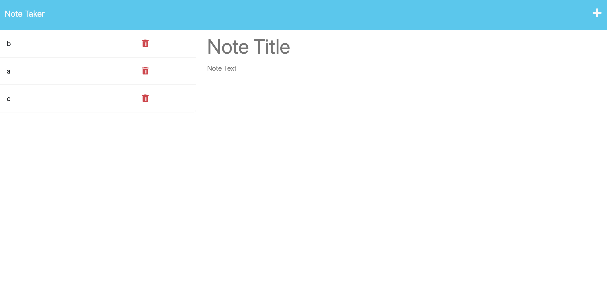

# Week 11 Challenge

## Links
Heroku: https://stark-atoll-39998.herokuapp.com/
Github: https://github.com/andyabebaw/Module11NotesApp
## Description

This website was built to keep track of notes

## Table of Contents (Optional)

- [Installation](#installation)
- [Usage](#usage)
- [Features](#features)

## Installation

1. Go To https://github.com/andyabebaw/Module11NotesApp/
2. Copy the Git clone link using SSH.
3. In terminal on your local device, clone the repository using Git clone.
4. Open in Visual Studio.

## Usage

This website can be used to view, add, and delete notes

## Required Features

- add notes
- view notes
- delete notes (bonus)

## How to Contribute

Follow the Installation Instructions above or click here: [Installation](#installation)
Make changes to index.html to add, remove, or change sections.  Edit the style.css to change the website appearance.  Also free to add new images in the images in images folder to be used on the site.
